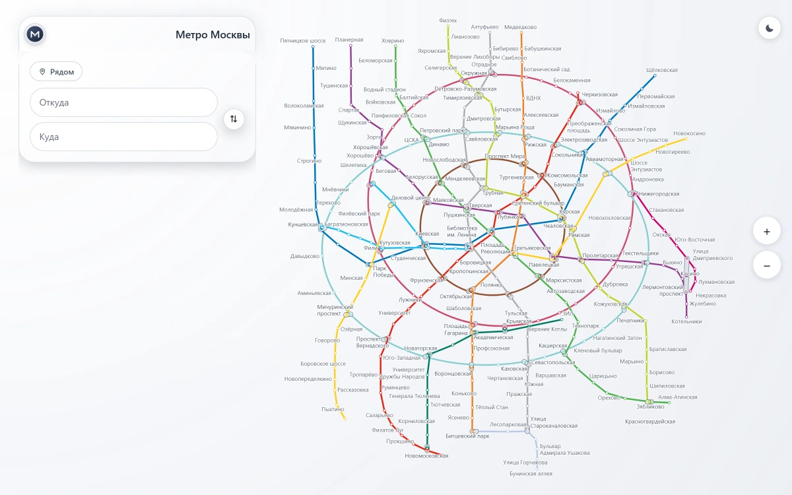
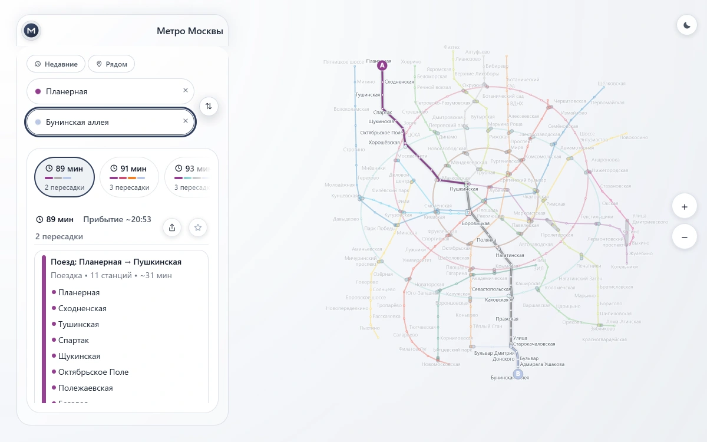
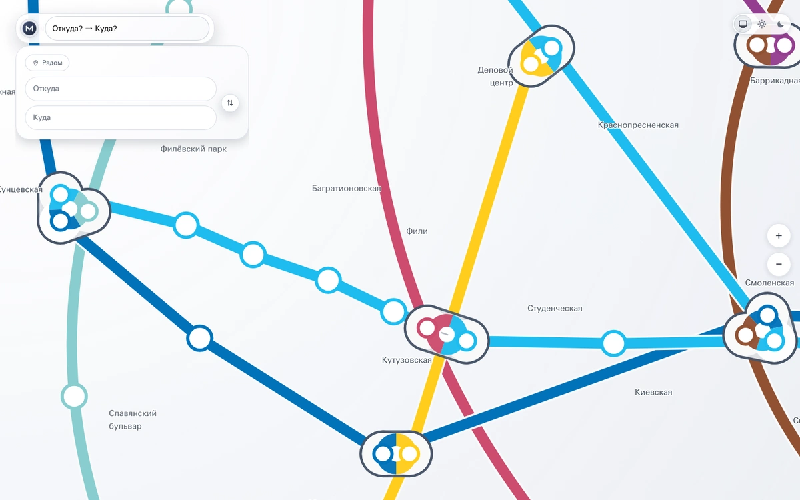

# Moscow Metro

[Русский](README.md) · English

[](https://github.com/tr0llex/metro-map/actions/workflows/ci.yml)
[](https://codecov.io/gh/tr0llex/metro-map)
[](https://metro.samoy.love)

An offline-first route planner for the Moscow Metro, for anyone who needs the
diagram underground where there is no network:
**[metro.samoy.love](https://metro.samoy.love)** — install it once and it keeps
working with the connection off.

Every metro app can find you a route. Few of them draw the diagram well. A metro
diagram is not a map: it is a deliberate lie about geography, told so that
someone standing on a platform can read it in three seconds. The rules of that
lie are old and specific — lines run at multiples of 45°, rings stay smooth, the
stations of one interchange merge into a single node, and every label has to be
readable without covering anything else. Here those rules are the product;
routing is the easy half.

| The whole network | A route | A merged interchange |
|---|---|---|
|  |  |  |

## How it works

**The geometry is solved ahead of time, in Go, because the phone should not do
it.** [`go-layout-solver/`](go-layout-solver/) is ~3400 lines that straighten
lines to octolinear angles, smooth the rings and push apart colliding stations
across 304 stations, 16 lines and 386 edges. Its thresholds are derived from the
renderer's own constants ([`separation.go`](go-layout-solver/separation.go)), so
the optimiser measures in the same pixels the canvas paints in. The app never
computes layout — it reads solved coordinates.

**Label placement is a cost function, because "readable" has to be a number.**
Overlapping labels, covered stations and crossed lines each carry an explicit
penalty, and the ratio between them is the actual design decision; see
[`docs/QUALITY.md`](docs/QUALITY.md). The analyser scores 25 metrics over the
solved diagram, and the same layout code runs in two runtimes —
[`MetroMapLabelLayout.ts`](src/components/MetroMapLabelLayout.ts) depends on
neither DOM nor React, the text measurer is injected (`ctx.measureText` in the
browser, a metrics table in Node). There used to be two copies required to agree
exactly, with nothing to check that they did.

**CI checks drift, not thresholds, because a signal that is always red stops
being a signal.** The quality analyser is deterministic and its report is
committed; the job recomputes it and fails when it differs from the baseline. A
deliberate change to the diagram is green as soon as the new report is committed
alongside it; an accidental regression is not.

**Routing runs in a worker on a 20 KB graph, because the worker is a separate
bundle.** Importing the full graph there would have duplicated ~123 KB of JSON,
so [`routingGraphPayload.ts`](src/metro/routingGraphPayload.ts) encodes edges
only. The asset sits outside `assets/` on purpose: `vite-plugin-pwa` marks that
folder `revision: null`, and a fixed-name file there would stay precached
forever.

**Updates wait for the user, because an offline app cannot be swapped under
their feet.** No `skipWaiting`, no `clientsClaim`: with `registerType: 'prompt'`
a new service worker waits for a confirmation, since activating it under an
already-loaded page turns that page's lazy chunks into 404s. See
[`docs/service-worker.md`](docs/service-worker.md).

## Stack

**Client** — React 19, TypeScript 6, Vite 8 and Canvas 2D; routing in a Web
Worker, PWA and precache through `vite-plugin-pwa`. The interface is in Russian
only.

**Data and geometry** — a Go layout solver over `data/`, the single source of
truth: one file per line plus `transfers.json` and `layout.json`. Station ids
look like `1/park-kultury`.

```
data/  →  go-layout-solver  →  normalized/fullGraph.json  →  app
```

**Production** — static files behind the system nginx, released through
[deploy-kit](https://github.com/tr0llex/deploy-kit).

## Quick start

```bash
npm install
npm run dev          # dev server
npm run dev:pwa      # dev server with the service worker on
npm run dev:editor   # schematic editor (editor.html)
npm run build        # tsc -b && vite build -> dist/
```

Rebuilding the data needs Go:

```bash
npm run build:data   # data/ -> normalized/fullGraph.json
npm run quality      # layout quality report
```

The editor closes the loop: dragging a station and saving writes straight into
`data/` and re-runs the solver, so a drag in the browser ends up as a diff in a
JSON file. The write endpoint lives in a Vite plugin with `apply: 'serve'` and
never reaches a build; a guard asserts the editor itself never reaches the
production bundle.

Every command, the end-to-end coverage and the pre-commit checklist:
[`docs/workflow.md`](docs/workflow.md).

## Layout

| Path | Purpose |
| --- | --- |
| `data/` | The diagram source of truth: lines, transfers, layout hints |
| `go-layout-solver/` | The Go solver: graph, octolinear angles, ring shapes, station separation |
| `normalized/` | Derived data: `fullGraph.json` and the committed `quality_report.json` |
| `src/` | The app: React shell, Canvas renderer, metro model, routing |
| `src/metro/` | Graph, routing and the compact routing payload for the worker |
| `src/components/` | `MetroMap.tsx` (~4400 lines of canvas drawing) and the label layout |
| `scripts/` | Guards: editor out of production, undeclared CSS variables |
| `scripts/quality/` | The quality analyser behind `npm run quality` |
| `scripts/editor/` | Writing editor changes back into `data/` (dev server only) |
| `e2e/` | Playwright tests over the user's path, including offline |
| `tools/visual-qa/` | Pixel acceptance harness (Docker + Chromium) |
| `public/` | Icons and favicon |
| `docs/` | Quality metrics, visual acceptance, service worker, workflow notes |
| `.deploy-kit/` | Deployment target description |

The PWA manifest and the service worker name are generated by `vite-plugin-pwa`
from the `manifest` section of `vite.config.ts` — there is no `.webmanifest` in
`public/` and there should not be one.

## Tests

475 unit tests in 31 files (Vitest) plus 8 end-to-end tests in Playwright, and 2
more that run against production by hand.

```bash
npx tsc -b && npm run lint && npx vitest run
npm run e2e            # builds the project and starts preview itself
npm run e2e:prod       # smoke against https://metro.samoy.love, not in CI
bash tools/visual-qa/run.sh   # pixel acceptance in Docker
```

CI gates the typecheck, ESLint, the CSS custom-property guard, the unit tests
with coverage, the build, the "editor is absent from the production bundle"
check, the end-to-end run and the quality report drift. End-to-end tests fail on
silence too: every one of them also asserts that the browser console stayed clean
and no request failed, because an app serving 200 with a dead routing worker
looks alive by status code alone. Offline is covered for real — the second visit
runs with the network cut off. Pixel acceptance
([`docs/VISUAL_QA.md`](docs/VISUAL_QA.md)) is a local Docker step, not a CI job:
it fails on more than 0.1% changed pixels, and a missing screenshot counts as a
failure.

## Deployment

```bash
dk deploy metro       # deploy, the same path CI takes
dk rollback metro
```

The build is unpacked next to the current release, the symlink is switched
atomically and the version is verified afterwards. The target description is
`.deploy-kit/prod.env`; the nginx configuration and the release scripts live in
[deploy-kit](https://github.com/tr0llex/deploy-kit). Deployment stays a
deliberate manual step: for an installed PWA a release reaches users on the
service worker's terms, not the pipeline's.

## Part of samoy.love

`samoy.love` reads as the owner's surname, Samoylov. One domain, one server, one
release pipeline, one status page.

| Service | What it is | Repository |
| --- | --- | --- |
| [samoy.love](https://samoy.love) | Personal page and project showcase | [tr0llex/samoy.love](https://github.com/tr0llex/samoy.love) |
| [metro.samoy.love](https://metro.samoy.love) | This app | [tr0llex/metro-map](https://github.com/tr0llex/metro-map) |
| [snakes.samoy.love](https://snakes.samoy.love) | Multiplayer territory capture in the browser | [tr0llex/snakes](https://github.com/tr0llex/snakes) |
| [launcher.samoy.love](https://launcher.samoy.love) | ChillHub, a game launcher for Windows | [tr0llex/chillhub](https://github.com/tr0llex/chillhub) |
| [status.samoy.love](https://status.samoy.love) | Uptime, versions, incidents | [tr0llex/status.samoy.love](https://github.com/tr0llex/status.samoy.love) |
| Monitoring | Prometheus, Grafana, traffic from nginx logs | [tr0llex/metrics.samoy.love](https://github.com/tr0llex/metrics.samoy.love) |

They all ship through one tool,
[deploy-kit](https://github.com/tr0llex/deploy-kit): one target description in
the repository, one `release.sh` on the server, one nginx configuration for
everything.

## Contacts and license

Alexey Samoylov — <alex@samoy.love>, [t.me/tr0llex](https://t.me/tr0llex),
[github.com/tr0llex](https://github.com/tr0llex). Tasks live in
[issues](https://github.com/tr0llex/metro-map/issues).

The code is MIT, see [LICENSE](LICENSE). Station names, line composition and
interchange times follow the official Moscow Metro scheme; the geometry is not
copied from it — coordinates were seeded from public reference data, then solved
and adjusted here. The official scheme's graphic design is its authors' work:
this project does not reproduce it, it draws its own diagram under the same
well-known conventions.
