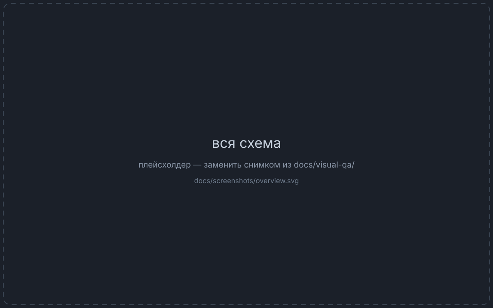
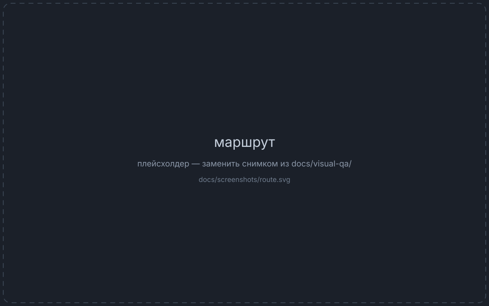
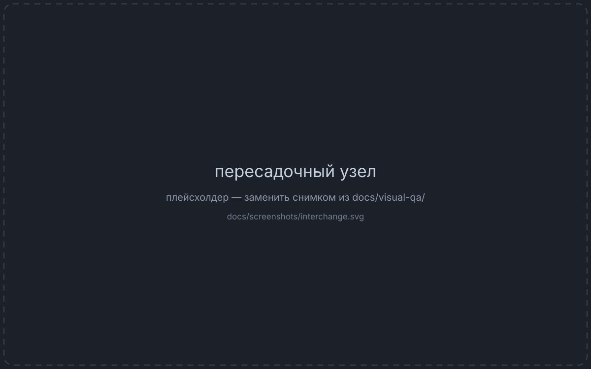

English · [Русский](docs/README.ru.md)

# Moscow Metro

**[metro.samoy.love](https://metro.samoy.love)** — an offline-first route planner for the
Moscow Metro. The diagram is drawn on canvas from pre-solved coordinates and routes are
computed on the device, so the whole thing keeps working with no network at all.

[](https://github.com/tr0llex/metro-map/actions/workflows/ci.yml)
[](https://codecov.io/gh/tr0llex/metro-map)

<!-- Плейсхолдеры. Как заменить — docs/screenshots/README.md -->

| Whole network | A route | A merged interchange |
|---|---|---|
|  |  |  |

## Why

Every metro app can find you a route. Few of them draw the diagram well.

A metro diagram is not a map. It is a deliberate lie about geography, told so that
someone standing on a platform can read it in three seconds. The rules of that lie are
old and specific: lines run at multiples of 45°, rings stay smooth, the stations of one
interchange merge into a single node, and every label has to be readable without covering
anything else.

Here those rules are the actual product. Routing is the easy half.

## What is interesting here

**A geometry solver in Go** — [`go-layout-solver/`](go-layout-solver/), ~3400 lines. It
straightens lines to octolinear angles, smooths rings, and pushes apart stations that
collide. Its thresholds are derived from the renderer's own constants
([`separation.go`](go-layout-solver/separation.go)): the optimiser measures in the same
pixels the canvas paints in.

**One label layout, two runtimes.**
[`MetroMapLabelLayout.ts`](src/components/MetroMapLabelLayout.ts) depends on neither DOM
nor React — the text measurer is injected (`ctx.measureText` in the browser, a metrics
table in Node). There used to be two copies required to agree exactly, with nothing to
check that they did.

**Label placement as a cost function.** Overlapping labels, covered stations and crossed
lines each carry an explicit penalty, and the ratio between them is the design decision —
see [`docs/QUALITY.md`](docs/QUALITY.md). Tuning that ratio moved unplaced labels in the
dense centre from 22.6% to 9.7%.

**A 20 KB routing graph.** The worker is bundled separately, so importing the full graph
would have duplicated ~123 KB of JSON;
[`routingGraphPayload.ts`](src/metro/routingGraphPayload.ts) encodes edges only. It also
sits outside `assets/` on purpose — `vite-plugin-pwa` marks that folder `revision: null`,
and a fixed-name file there would stay precached forever.

**Pixel-level visual acceptance in Docker.** `MetroMap.tsx` is 4700 lines of canvas
drawing that unit tests cannot see. [`tools/visual-qa/`](tools/visual-qa/) runs real
Chromium against a static server inside the container — no host access at all — and fails
on more than 0.1% changed pixels. A missing screenshot counts as a failure.

**End-to-end tests that fail on silence.** Every Playwright test in [`e2e/`](e2e/) also
asserts that the browser console stayed clean and no request failed. An app serving 200
with a dead routing worker looks alive by status code alone; here it is red. Offline is
covered for real — the second visit runs with the network cut off.

**CI checks drift, not thresholds.** The quality analyser is deterministic and its report
is committed; the job compares against that report rather than against absolute numbers.
A signal that is always red stops being a signal.

**Offline updates that don't break.** No `skipWaiting`, no `clientsClaim`: with
`registerType: 'prompt'` a new service worker waits for the user to confirm, because
activating it under an already-loaded page turns its lazy chunks into 404s.

**A CSS-variable guard.** Once, 283 uses of `var(--space-*)` survived with zero
declarations — `tsc`, ESLint, Vitest and the build all green while the app rendered with
no spacing at all. [`scripts/check-css-tokens.mjs`](scripts/check-css-tokens.mjs) is now
its own CI step.

**A built-in schematic editor.** `npm run dev:editor` opens the map with draggable
stations; saving writes straight into `data/` and re-runs the solver, so a drag in the
browser ends up as a diff in a JSON file. It is a separate entry point, and a guard
([`scripts/check-prod-bundle.mjs`](scripts/check-prod-bundle.mjs)) asserts it never
reaches the production bundle.

## Stack

React 19 · TypeScript 6 · Vite 8 · Vitest 4 · ESLint 10 · Go (layout solver) · Canvas 2D ·
Web Worker routing · `vite-plugin-pwa`

The interface is in Russian only.

## Quick start

```bash
npm install
npm run dev
```

```bash
npm run dev:editor   # schematic editor
npm run build        # tsc -b && vite build -> dist/
npm run lint
npx vitest run
npm run e2e          # end-to-end tests against a local production build
```

`npm run e2e` builds the project and starts `preview` itself — the production build
specifically, because a service worker and its precache do not exist in dev mode. The
browser is installed once with `npx playwright install chromium`.

Rebuilding the data needs Go:

```bash
npm run build:data   # data/ -> normalized/fullGraph.json
npm run quality      # schematic quality report
```

The UI never computes layout — it reads solved coordinates. After touching the solver,
run `npm run build:data`.

## How the data flows

`data/` is the single source of truth: one file per line, plus `transfers.json` and
`layout.json`. Station ids look like `1/park-kultury`.

```
data/  →  go-layout-solver  →  normalized/fullGraph.json  →  app
```

The editor closes the loop by writing back into `data/` and re-running the solver.

## Data and rights

Station names, line composition and interchange times follow the official Moscow Metro
scheme. The geometry is not copied from it: coordinates were seeded from public reference
data, then solved and adjusted here. The official scheme's graphic design is its authors'
work — this project does not reproduce it, it draws its own diagram under the same
well-known conventions.

No licence is granted for reuse. The code is public to be read.

## Part of samoy.love

`samoy` reads as the owner's surname, Samoylov. Neighbouring sites on the same host:
[samoy.love](https://samoy.love) · [snakes.samoy.love](https://snakes.samoy.love) ·
[launcher.samoy.love](https://launcher.samoy.love) · [status.samoy.love](https://status.samoy.love)

Everything ships through one shared tool,
[deploy-kit](https://github.com/tr0llex/deploy-kit). Deployment stays a deliberate manual
step: for an installed PWA a release reaches users on the service worker's terms, not the
pipeline's.

---

Detailed notes live in [`docs/`](docs/) — [quality metrics](docs/QUALITY.md),
[visual acceptance](docs/VISUAL_QA.md), [service worker](docs/service-worker.md).
Tasks are in [issues](https://github.com/tr0llex/metro-map/issues).
